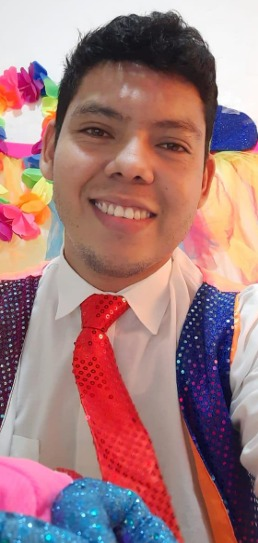

DarioGutierrez
# grupo3_programadores

<h1> Dario Gutierrez <h1>

  Artista 

 Soy de Colombia, actualmente estoy viviendo en Villavicencio, departamento del Meta 

 Dario Gutierrez estudiante de ingeniería multimedia de séptimo periodo. 

 Me gustan mucho los videojuegos, me enfoco principalmente en el ambito visual, desde la creación de personajes en concept art 

 hasta su diseño y adaptación a entornos visuales 2d y 3d (aunque esta ultima aún la estoy perfeccionando) 

RoynherMontero
3-delfinesinteligentes

## Foto personal

## Nombre
Roynher Alberto Montero Muñoz

## Rol en la industria
Programador(creador delineas de codigo)

## Ubicación
Leticia, Amazonas – Colombia (Origen: Barranquilla, Atlántico)

## Perfil
Soy Roynher Alberto Montero Muñoz, estudiante de Ingeniería Multimedia 8 semestre. Nací en Barranquilla y actualmente resido en Leticia, Amazonas. Me interesa el desarrollo multimedia, especialmente en el área de animación digital, modelado 3D y creación de contenido interactivo.

Me considero una persona responsable, comprometido y con gran disposición para el aprendizaje continuo. Disfruto trabajar en proyectos creativos que integren diseño, tecnología e innovación.

El fútbol es mi deporte favorito, ya que fomenta el trabajo en equipo, la disciplina y la perseverancia, valores que también aplico en mi formación académica y profesional.

 AlvaroCampo
# 3_delfinesinteligentes

<h1> Alvaro Campo <h1>

  Producción audiovisual, Músico. 

 Municipio de Pivijay - Magdalena 

 Estudiante de ingeniería multimedia y me encuentro actualmente cursando el séptimo periodo. 

 Soy cristiano, apasiondo por la musica, la producción musical y todo lo relacionado con la producción audiovisual. Dentro del amplio contexto de la multimedia, tengo inclinación hacia la animación 2D y 3D, por ello actualmente me encuentro en proceso de preparación para desarrollar mis competencias como animador. 

# 3-delfinesinteligentes
MateoPerez
<h1> Wber Mateo Perez Suarez <h1>

 Rol por definir

 Soy de la ciudad de Medellin y actualmente vivo en Guatapé

 Estoy en 8vo semestre de Ingeniera Multimedia y Soy deportista de Alto Rendimiento 

 el deporte que practico se llama Canotaje y tengo 17 años de experiencia 

# Información del integrante

## Foto personal

## Nombre
Alejandra Pinzón

## Rol en la industria
Producción audiovisual y desarrollo multimedia

## Ubicación
Villavicencio, Meta – Colombia (CEAD Acacías)

## Perfil
Soy Alejandra Pinzón, monitora de comunicaciones y marketing de la Zona Amazonía Orinoquía (ZAO). Vivo en Villavicencio, aunque la mayor parte del tiempo estoy en el CEAD Acacías. Actualmente soy estudiante de Ingeniería Multimedia en séptimo periodo. Me apasiona la producción audiovisual, la animación y la posproducción, áreas en las que busco seguir fortaleciendo mis habilidades y aportar creativamente en proyectos digitales y multimedia.
main
main
main
main
